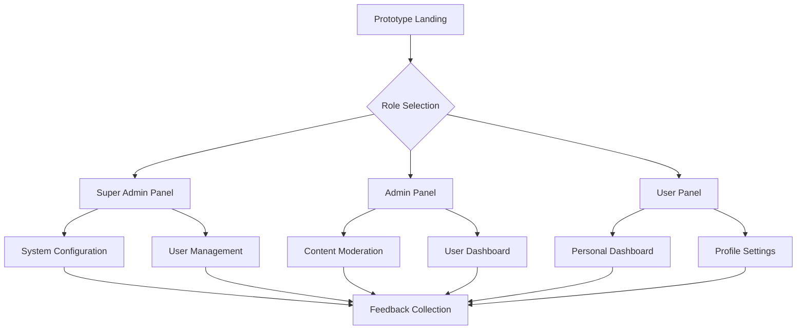

## 1. Product Overview
A non-destructive panel redesign prototype that provides isolated testing environment for new admin, superadmin, and user panel interfaces without affecting the current production codebase. This prototype allows stakeholders to evaluate new design concepts, user experience improvements, and functionality enhancements before committing to a full migration.

The prototype serves as a proof-of-concept for modernizing the existing panel interfaces while maintaining backward compatibility and zero impact on current user operations.

## 2. Core Features

### 2.1 User Roles
| Role | Registration Method | Core Permissions |
|------|---------------------|------------------|
| Super Admin | Pre-configured system access | Full system configuration, user management, module control, system settings |
| Admin | Admin panel invitation/creation | User management within assigned scope, content moderation, reporting access |
| User | Standard registration flow | Personal dashboard, profile management, basic application features |

### 2.2 Feature Module
The panel redesign prototype consists of the following main interfaces:
1. **Super Admin Panel**: System-wide configuration, user role management, module controls, analytics overview.
2. **Admin Panel**: User management, content moderation, reporting tools, administrative functions.
3. **User Panel**: Personal dashboard, profile settings, application features, user-specific tools.
4. **Prototype Landing**: Role selection interface, version comparison, feedback collection.

### 2.3 Page Details
| Page Name | Module Name | Feature description |
|-----------|-------------|---------------------|
| Prototype Landing | Role Selection | Choose between superadmin, admin, or user panel experiences with version comparison options |
| Super Admin Panel | Dashboard Overview | View system analytics, user statistics, module performance metrics with real-time data visualization |
| Super Admin Panel | User Management | Create/edit/delete users, assign roles, manage permissions, bulk operations with advanced filtering |
| Super Admin Panel | System Configuration | Configure application settings, manage modules, customize system parameters with validation |
| Admin Panel | User Dashboard | Monitor user activities, manage user accounts, view user-generated content with moderation tools |
| Admin Panel | Content Moderation | Review flagged content, approve/reject submissions, manage reported items with batch processing |
| Admin Panel | Reports & Analytics | Generate user reports, view engagement metrics, export data in multiple formats |
| User Panel | Personal Dashboard | View personal statistics, recent activities, quick actions with customizable widgets |
| User Panel | Profile Settings | Update personal information, change preferences, manage privacy settings with validation |
| User Panel | Application Features | Access core application functionality with improved UI/UX and enhanced navigation |

## 3. Core Process
**Prototype Access Flow**: Users access the prototype through a dedicated route that provides role selection. Each role leads to its respective panel interface with isolated assets and routing. The prototype maintains separate styling, scripts, and components to ensure zero conflicts with the existing application.

**Testing & Feedback Flow**: Users can switch between old and new interfaces for comparison. Feedback collection forms are integrated throughout the prototype to gather user experience data and improvement suggestions.

## 4. User Interface Design

### 4.1 Design Style
- **Primary Colors**: Modern blue (#2563eb) for primary actions, slate gray (#64748b) for secondary elements
- **Secondary Colors**: Success green (#10b981), warning amber (#f59e0b), error red (#ef4444)
- **Button Style**: Rounded corners (8px radius), subtle shadows, hover animations
- **Typography**: Inter font family, 14px base size, clear hierarchy with font weights 400, 500, 600, 700
- **Layout Style**: Card-based layout with consistent spacing (8px grid system), top navigation with sidebar
- **Icon Style**: Heroicons outline style, consistent 20px size, meaningful metaphors

### 4.2 Page Design Overview
| Page Name | Module Name | UI Elements |
|-----------|-------------|-------------|
| Prototype Landing | Role Selection | Centered card layout with three prominent role cards, hover effects, version comparison toggle |
| Super Admin Panel | Dashboard Overview | Grid-based widget layout, dark header with white cards, chart.js visualizations, responsive tables |
| Admin Panel | User Dashboard | Clean white background, subtle borders, action buttons with icons, search and filter bar |
| User Panel | Personal Dashboard | Personalized greeting card, activity timeline, quick action buttons, customizable widget arrangement |

### 4.3 Responsiveness
Desktop-first design approach with mobile adaptation. Breakpoints at 768px (tablet) and 1024px (desktop). Touch interaction optimization for mobile devices with larger tap targets and swipe gestures where appropriate.