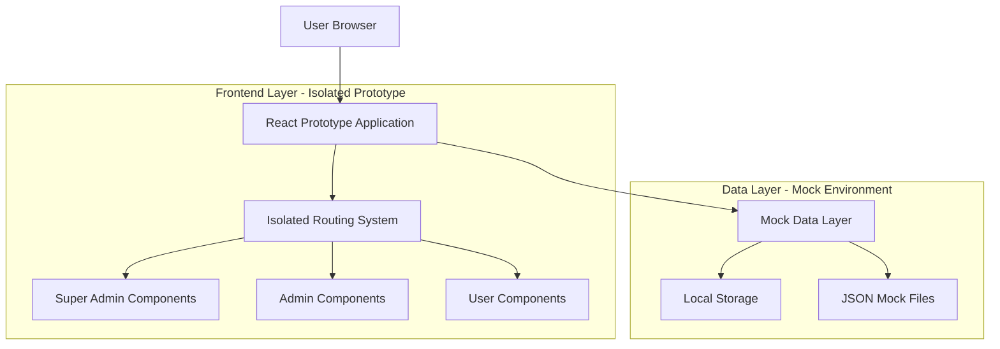
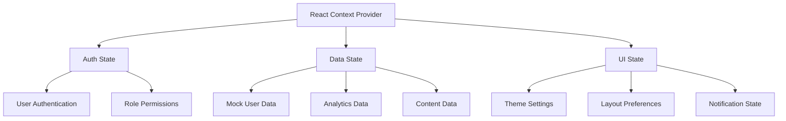
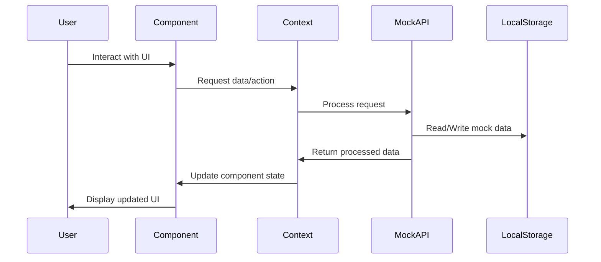

## 1. Architecture Design



## 2. Technology Description

- Frontend: React@18 + tailwindcss@3 + vite
- Initialization Tool: vite-init
- Backend: None (Mock data environment)
- Routing: React Router@6
- State Management: React Context + useReducer
- Styling: Tailwind CSS with custom design tokens
- Icons: Heroicons
- Charts: Chart.js for data visualization

## 3. Route Definitions

| Route | Purpose |
|-------|---------|
| /prototype/panelredesign | Prototype landing page with role selection |
| /prototype/panelredesign/superadmin | Super admin panel dashboard |
| /prototype/panelredesign/superadmin/users | User management interface |
| /prototype/panelredesign/superadmin/settings | System configuration page |
| /prototype/panelredesign/admin | Admin panel dashboard |
| /prototype/panelredesign/admin/users | User management for admins |
| /prototype/panelredesign/admin/content | Content moderation interface |
| /prototype/panelredesign/admin/reports | Analytics and reporting |
| /prototype/panelredesign/user | User panel dashboard |
| /prototype/panelredesign/user/profile | User profile settings |
| /prototype/panelredesign/user/features | Application features page |
| /prototype/panelredesign/feedback | Feedback collection form |

## 4. Component Architecture

### 4.1 Core Component Structure
```
src/
├── components/
│   ├── common/
│   │   ├── Layout.jsx
│   │   ├── Header.jsx
│   │   ├── Sidebar.jsx
│   │   ├── Card.jsx
│   │   └── Button.jsx
│   ├── superadmin/
│   │   ├── Dashboard.jsx
│   │   ├── UserManagement.jsx
│   │   ├── SystemConfig.jsx
│   │   └── Analytics.jsx
│   ├── admin/
│   │   ├── Dashboard.jsx
│   │   ├── UserManagement.jsx
│   │   ├── ContentModeration.jsx
│   │   └── Reports.jsx
│   └── user/
│       ├── Dashboard.jsx
│       ├── Profile.jsx
│       └── Features.jsx
├── contexts/
│   ├── AuthContext.jsx
│   ├── DataContext.jsx
│   └── ThemeContext.jsx
├── hooks/
│   ├── useMockData.js
│   ├── usePagination.js
│   └── useFilters.js
├── data/
│   ├── mockUsers.json
│   ├── mockAnalytics.json
│   └── mockContent.json
└── styles/
    ├── globals.css
    └── components.css
```

### 4.2 Mock Data API Structure

```javascript
// Mock user data structure
const mockUser = {
  id: "uuid",
  role: "superadmin|admin|user",
  name: "string",
  email: "string",
  avatar: "string",
  permissions: ["array"],
  lastActive: "timestamp",
  createdAt: "timestamp"
}

// Mock analytics data
const mockAnalytics = {
  totalUsers: "number",
  activeUsers: "number",
  newUsers: "number",
  revenue: "number",
  charts: {
    userGrowth: "array",
    revenueTrend: "array",
    activityLog: "array"
  }
}
```

## 5. State Management Architecture



## 6. Build and Development Configuration

### 6.1 Vite Configuration
- Development server on port 3001 (isolated from main application)
- Hot module replacement for rapid prototyping
- Proxy configuration for potential API integration
- Environment-specific builds (development/staging/production)

### 6.2 Isolation Strategy
- Separate build output directory (`dist-prototype/`)
- Unique CSS class prefixes to avoid conflicts
- Isolated localStorage keys with `prototype_` prefix
- Separate asset compilation and optimization

## 7. Data Flow Architecture

### 7.1 Mock Data Flow


### 7.2 Feedback Collection Flow
- Integrated feedback forms in each panel
- Data stored in localStorage with export functionality
- Analytics tracking for user interactions
- Version comparison feedback collection

## 8. Deployment Considerations

### 8.1 Static Deployment
- Build as static files for easy deployment
- Environment variables for configuration
- CDN-ready asset optimization
- Progressive Web App capabilities

### 8.2 Integration Points
- Optional API integration hooks for real data testing
- Webhook endpoints for feedback collection
- Analytics integration for user behavior tracking
- A/B testing framework preparation